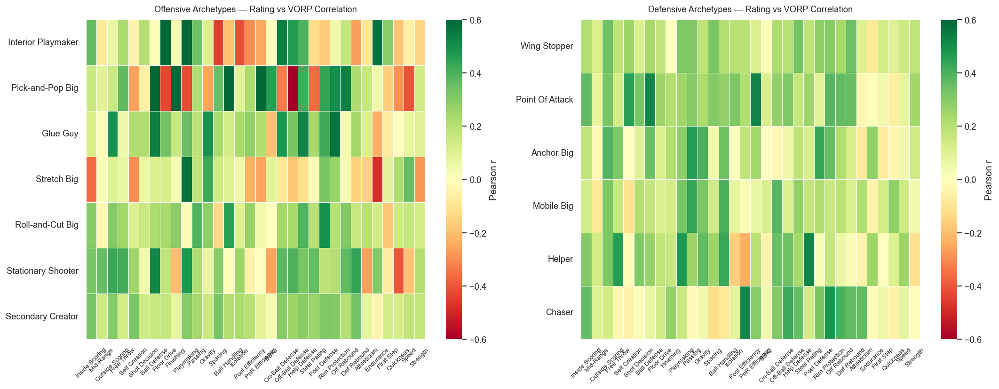
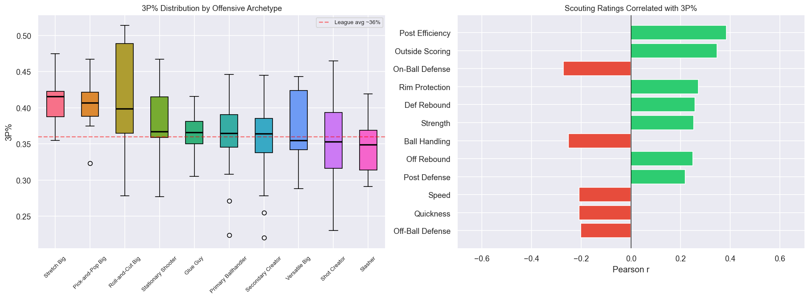
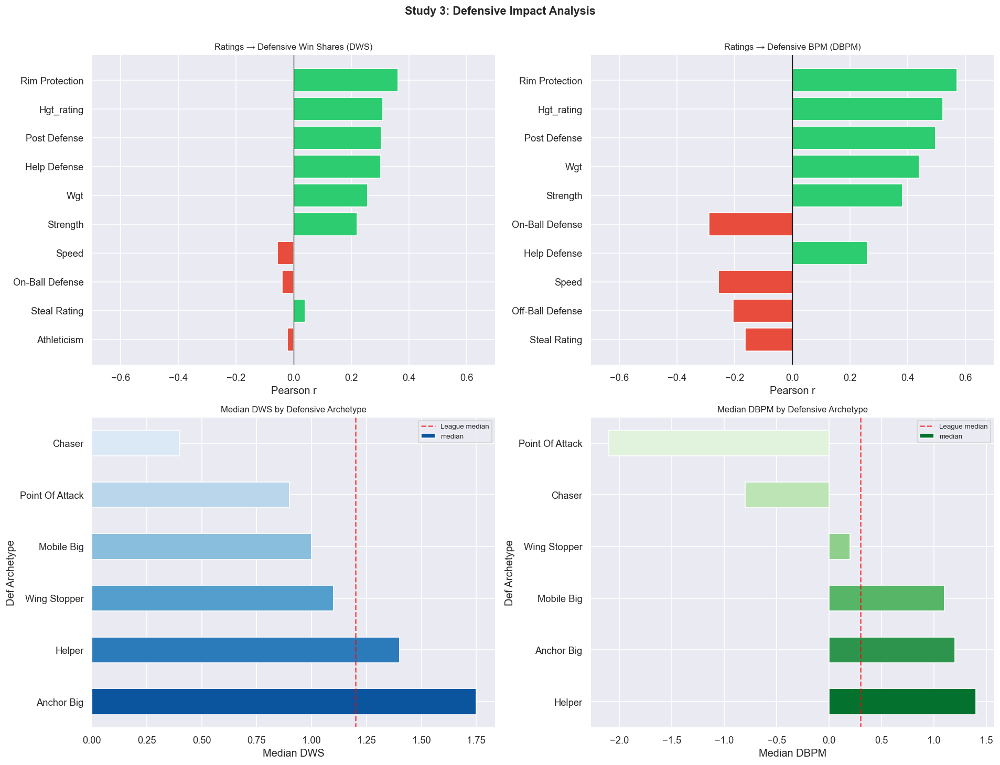
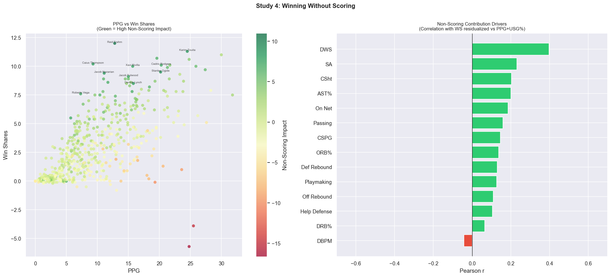
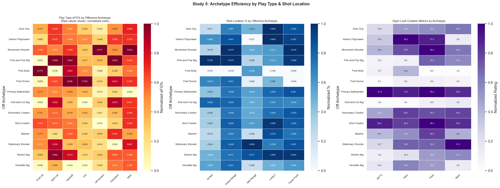

# JBL Moneyball — Phase 2 Analysis Report

---

## Study 1 — Rating-to-Impact by Archetype

> Which scouting ratings actually translate to production for each player type?

### Offensive Archetypes

#### Glue Guy (n=34)

**→ VORP:** Rim Protection (r=+0.56), Ball Defense (r=+0.53), Help Defense (r=+0.53), Gravity (r=+0.50), Outside Scoring (r=+0.49)

**→ WS_actual:** Ball Defense (r=+0.66), Rim Protection (r=+0.56), Gravity (r=+0.51), Help Defense (r=+0.42), On-Ball Defense (r=+0.41)

**→ eFG%:** Shot Decision (r=+0.56), Help Defense (r=+0.44), Isolation (r=+0.43), Off-Ball Defense (r=+0.41), Outside Scoring (r=+0.38)

#### Interior Playmaker (n=13)

**→ VORP:** Floor Drive (r=+0.69), Playmaking (r=+0.59), Endurance (r=+0.57), On-Ball Defense (r=+0.54), Off-Ball Defense (r=+0.47)

**→ WS_actual:** Floor Drive (r=+0.76), Spacing (r=-0.60), Endurance (r=+0.53), Isolation (r=-0.47), Passing (r=+0.46)

**→ eFG%:** Floor Drive (r=+0.74), Steal Rating (r=-0.74), Ball Defense (r=+0.73), Quickness (r=-0.55), Rim Protection (r=+0.52)

#### Pick-and-Pop Big (n=11)

**→ VORP:** Finishing (r=+0.74), Ball Defense (r=+0.73), Ball Handling (r=+0.63), Off-Ball Defense (r=-0.62), PnR Efficiency (r=+0.62)

**→ WS_actual:** Finishing (r=+0.78), Ball Defense (r=+0.62), Off Rebound (r=+0.61), Ball Handling (r=+0.60), Off-Ball Defense (r=-0.56)

**→ eFG%:** PnR Efficiency (r=+0.67), Off Rebound (r=+0.64), Steal Rating (r=-0.62), On-Ball Defense (r=-0.60), Passing (r=+0.53)

#### Post Scorer (n=37)

**→ VORP:** Ball Handling (r=+0.50), PnR Efficiency (r=+0.47), Shot Decision (r=+0.39), Free Throw (r=+0.39), Passing (r=+0.35)

**→ WS_actual:** Shot Decision (r=+0.52), Steal Rating (r=+0.43), Mid-Range (r=+0.37), On-Ball Defense (r=+0.36), Ball Handling (r=+0.35)

**→ eFG%:** Free Throw (r=+0.40), First Step (r=+0.27), Playmaking (r=-0.27), BBIQ (r=+0.22), Quickness (r=+0.21)

#### Primary Ballhandler (n=63)

**→ VORP:** Ball Defense (r=+0.53), PnR Efficiency (r=+0.49), Outside Scoring (r=+0.45), Off-Ball Defense (r=+0.43), Ball Handling (r=+0.41)

**→ WS_actual:** PnR Efficiency (r=+0.49), Ball Defense (r=+0.45), Off-Ball Defense (r=+0.44), On-Ball Defense (r=+0.41), Gravity (r=+0.38)

**→ eFG%:** Off-Ball Defense (r=+0.36), Athleticism (r=-0.28), On-Ball Defense (r=+0.27), First Step (r=-0.25), Self Creation (r=+0.25)

#### Roll-and-Cut Big (n=70)

**→ VORP:** Post Defense (r=+0.50), Ball Handling (r=+0.45), Help Defense (r=+0.39), Passing (r=+0.39), Off Rebound (r=+0.31)

**→ WS_actual:** Floor Drive (r=+0.37), Ball Handling (r=+0.36), Help Defense (r=+0.35), Quickness (r=+0.32), Off Rebound (r=+0.31)

**→ eFG%:** Athleticism (r=+0.30), Mid-Range (r=-0.28), Post Defense (r=+0.24), Steal Rating (r=-0.23), Help Defense (r=+0.21)

#### Secondary Creator (n=152)

**→ VORP:** Def Rebound (r=+0.34), Spacing (r=+0.33), Inside Scoring (r=+0.33), Self Creation (r=+0.32), Post Defense (r=+0.31)

**→ WS_actual:** Def Rebound (r=+0.36), Playmaking (r=+0.32), On-Ball Defense (r=+0.31), Spacing (r=+0.29), Self Creation (r=+0.28)

**→ eFG%:** Outside Scoring (r=+0.23), First Step (r=+0.16), Free Throw (r=-0.15), On-Ball Defense (r=+0.15), Endurance (r=+0.15)

#### Shot Creator (n=41)

**→ VORP:** PnR Efficiency (r=+0.57), Def Rebound (r=+0.51), Isolation (r=+0.50), Ball Defense (r=+0.47), Off Rebound (r=+0.45)

**→ WS_actual:** PnR Efficiency (r=+0.62), Passing (r=+0.46), Ball Defense (r=+0.46), Inside Scoring (r=+0.45), Isolation (r=+0.45)

**→ eFG%:** Inside Scoring (r=+0.58), Passing (r=+0.43), Strength (r=+0.40), Ball Defense (r=+0.37), BBIQ (r=+0.34)

#### Slasher (n=16)

**→ VORP:** Help Defense (r=+0.50), Rim Protection (r=+0.49), PnR Efficiency (r=+0.48), Off Rebound (r=+0.47), Mid-Range (r=-0.41)

**→ WS_actual:** Help Defense (r=+0.59), Post Efficiency (r=+0.56), PnR Efficiency (r=+0.54), Athleticism (r=+0.49), Gravity (r=+0.43)

**→ eFG%:** Post Defense (r=+0.57), PnR Efficiency (r=+0.55), Strength (r=-0.52), Def Rebound (r=-0.45), Quickness (r=-0.42)

#### Stationary Shooter (n=17)

**→ VORP:** Ball Defense (r=+0.52), Playmaking (r=+0.48), Def Rebound (r=+0.44), Outside Scoring (r=+0.43), Free Throw (r=+0.41)

**→ WS_actual:** Playmaking (r=+0.54), Ball Defense (r=+0.52), Free Throw (r=+0.47), Off-Ball Defense (r=+0.46), Outside Scoring (r=+0.45)

**→ eFG%:** Outside Scoring (r=+0.58), On-Ball Defense (r=+0.48), Free Throw (r=+0.48), Playmaking (r=+0.46), Off-Ball Defense (r=+0.46)

#### Stretch Big (n=17)

**→ VORP:** Playmaking (r=+0.57), Endurance (r=-0.49), Gravity (r=+0.43), Inside Scoring (r=-0.36), Speed (r=+0.36)

**→ WS_actual:** Endurance (r=-0.54), Playmaking (r=+0.47), Self Creation (r=-0.32), Inside Scoring (r=-0.30), Post Defense (r=+0.30)

**→ eFG%:** Self Creation (r=-0.41), Ball Defense (r=+0.41), Def Rebound (r=+0.34), Inside Scoring (r=-0.27), Off Rebound (r=-0.27)

#### Versatile Big (n=36)

**→ VORP:** Outside Scoring (r=+0.55), Steal Rating (r=+0.53), On-Ball Defense (r=+0.46), Gravity (r=+0.45), First Step (r=+0.41)

**→ WS_actual:** Outside Scoring (r=+0.44), Gravity (r=+0.42), Steal Rating (r=+0.39), Off-Ball Defense (r=+0.38), Passing (r=+0.35)

**→ eFG%:** Gravity (r=+0.31), Passing (r=+0.23), Outside Scoring (r=+0.23), Off Rebound (r=+0.21), Def Rebound (r=+0.18)

### Defensive Archetypes

#### Anchor Big (n=88)

**→ VORP:** Passing (r=+0.46), Post Defense (r=+0.43), Gravity (r=+0.40), Outside Scoring (r=+0.39), Rim Protection (r=+0.36)

**→ WS_actual:** Gravity (r=+0.38), Passing (r=+0.36), Ball Handling (r=+0.34), Free Throw (r=+0.32), Playmaking (r=+0.29)

**→ eFG%:** Mid-Range (r=-0.27), Post Defense (r=+0.23), PnR Efficiency (r=+0.21), Athleticism (r=+0.21), Ball Defense (r=+0.19)

#### Chaser (n=32)

**→ VORP:** Post Efficiency (r=+0.52), Rim Protection (r=+0.48), Off-Ball Defense (r=+0.42), Off Rebound (r=+0.40), Athleticism (r=+0.37)

**→ WS_actual:** Post Efficiency (r=+0.45), Rim Protection (r=+0.45), Off-Ball Defense (r=+0.43), PnR Efficiency (r=+0.37), Help Defense (r=+0.36)

**→ eFG%:** Off-Ball Defense (r=+0.40), First Step (r=+0.28), Inside Scoring (r=+0.26), Mid-Range (r=+0.26), Self Creation (r=-0.26)

#### Helper (n=43)

**→ VORP:** Steal Rating (r=+0.52), Playmaking (r=+0.48), Free Throw (r=+0.46), Ball Handling (r=+0.43), Gravity (r=+0.37)

**→ WS_actual:** Playmaking (r=+0.45), Free Throw (r=+0.43), Gravity (r=+0.35), Ball Handling (r=+0.34), PnR Efficiency (r=+0.33)

**→ eFG%:** Spacing (r=+0.32), Passing (r=+0.29), BBIQ (r=-0.29), Rim Protection (r=+0.27), Gravity (r=+0.23)

#### Mobile Big (n=73)

**→ VORP:** Passing (r=+0.44), Ball Handling (r=+0.40), On-Ball Defense (r=+0.38), Playmaking (r=+0.33), Gravity (r=+0.32)

**→ WS_actual:** On-Ball Defense (r=+0.33), Help Defense (r=+0.32), Passing (r=+0.32), Quickness (r=+0.32), Ball Handling (r=+0.31)

**→ eFG%:** Endurance (r=-0.25), Def Rebound (r=+0.20), Inside Scoring (r=-0.19), Steal Rating (r=-0.18), Post Efficiency (r=+0.17)

#### Point Of Attack (n=104)

**→ VORP:** PnR Efficiency (r=+0.53), Ball Defense (r=+0.52), Self Creation (r=+0.45), Rim Protection (r=+0.38), Inside Scoring (r=+0.37)

**→ WS_actual:** PnR Efficiency (r=+0.54), Ball Defense (r=+0.47), Inside Scoring (r=+0.41), Self Creation (r=+0.39), Passing (r=+0.36)

**→ eFG%:** Inside Scoring (r=+0.42), Self Creation (r=+0.30), Off-Ball Defense (r=+0.28), Passing (r=+0.25), Strength (r=+0.25)

#### Wing Stopper (n=175)

**→ VORP:** Def Rebound (r=+0.34), Outside Scoring (r=+0.34), Help Defense (r=+0.33), Spacing (r=+0.33), Playmaking (r=+0.31)

**→ WS_actual:** Def Rebound (r=+0.34), Playmaking (r=+0.33), Help Defense (r=+0.30), Outside Scoring (r=+0.30), Passing (r=+0.29)

**→ eFG%:** Outside Scoring (r=+0.24), Gravity (r=+0.11), Shot Decision (r=+0.11), Off-Ball Defense (r=+0.11), Self Creation (r=+0.10)

### Key Findings

- **Glue Guy** (Offensive): *Rim Protection* is the #1 predictor of VORP (r=+0.56, n=34)
- **Glue Guy** (Offensive): *Ball Defense* is the #2 predictor of VORP (r=+0.53, n=34)
- **Glue Guy** (Offensive): *Ball Defense* is the #1 predictor of WS_actual (r=+0.66, n=34)
- **Glue Guy** (Offensive): *Rim Protection* is the #2 predictor of WS_actual (r=+0.56, n=34)
- **Glue Guy** (Offensive): *Shot Decision* is the #1 predictor of eFG% (r=+0.56, n=34)
- **Glue Guy** (Offensive): *Help Defense* is the #2 predictor of eFG% (r=+0.44, n=34)
- **Interior Playmaker** (Offensive): *Floor Drive* is the #1 predictor of VORP (r=+0.69, n=13)
- **Interior Playmaker** (Offensive): *Playmaking* is the #2 predictor of VORP (r=+0.59, n=13)
- **Interior Playmaker** (Offensive): *Floor Drive* is the #1 predictor of WS_actual (r=+0.76, n=13)
- **Interior Playmaker** (Offensive): *Spacing* is the #2 predictor of WS_actual (r=-0.60, n=13)
- **Interior Playmaker** (Offensive): *Floor Drive* is the #1 predictor of eFG% (r=+0.74, n=13)
- **Interior Playmaker** (Offensive): *Steal Rating* is the #2 predictor of eFG% (r=-0.74, n=13)
- **Pick-and-Pop Big** (Offensive): *Finishing* is the #1 predictor of VORP (r=+0.74, n=11)
- **Pick-and-Pop Big** (Offensive): *Ball Defense* is the #2 predictor of VORP (r=+0.73, n=11)
- **Pick-and-Pop Big** (Offensive): *Finishing* is the #1 predictor of WS_actual (r=+0.78, n=11)
- **Pick-and-Pop Big** (Offensive): *Ball Defense* is the #2 predictor of WS_actual (r=+0.62, n=11)
- **Pick-and-Pop Big** (Offensive): *PnR Efficiency* is the #1 predictor of eFG% (r=+0.67, n=11)
- **Pick-and-Pop Big** (Offensive): *Off Rebound* is the #2 predictor of eFG% (r=+0.64, n=11)
- **Post Scorer** (Offensive): *Ball Handling* is the #1 predictor of VORP (r=+0.50, n=37)
- **Post Scorer** (Offensive): *PnR Efficiency* is the #2 predictor of VORP (r=+0.47, n=37)

**Methodology:** Pearson correlation between each scouting rating and VORP/WS/eFG% within each archetype group. Minimum 8 players per archetype. Only correlations with |r| ≥ 0.30 reported as meaningful.

---
## Study 2 — Three Point Shooting Profile

> What player profile is most likely to be an elite 3-point shooter?

### 3P% by Offensive Archetype

| Off Archetype       |   mean |   median |   count |
|:--------------------|-------:|---------:|--------:|
| Stretch Big         |  0.409 |    0.416 |      15 |
| Pick-and-Pop Big    |  0.403 |    0.407 |       8 |
| Roll-and-Cut Big    |  0.414 |    0.398 |      14 |
| Stationary Shooter  |  0.378 |    0.367 |      13 |
| Glue Guy            |  0.364 |    0.366 |      25 |
| Primary Ballhandler |  0.365 |    0.365 |      48 |
| Secondary Creator   |  0.357 |    0.364 |     108 |
| Versatile Big       |  0.371 |    0.355 |      10 |
| Shot Creator        |  0.351 |    0.353 |      30 |
| Slasher             |  0.348 |    0.349 |       9 |

### Top Ratings Correlating with 3P% (min 60 3PA)

| Rating | Pearson r |
|--------|----------|

| Post Efficiency | +0.384 |

| Outside Scoring | +0.346 |

| On-Ball Defense | -0.272 |

| Rim Protection | +0.271 |

| Def Rebound | +0.257 |

| Strength | +0.253 |

| Ball Handling | -0.251 |

| Off Rebound | +0.249 |

| Post Defense | +0.217 |

| Speed | -0.209 |

| Quickness | -0.209 |

| Off-Ball Defense | -0.202 |

### Elite Shooter Breakdown (3P% ≥ 0.392)

**n = 81 elite shooters**

**Archetype distribution of elite shooters:**

- Secondary Creator: 22.2%

- Primary Ballhandler: 13.6%

- Stretch Big: 13.6%

- Shot Creator: 9.9%

- Roll-and-Cut Big: 9.9%

- Pick-and-Pop Big: 7.4%

- Stationary Shooter: 6.2%

- Versatile Big: 4.9%

- Glue Guy: 3.7%

- Interior Playmaker: 3.7%

- Post Scorer: 2.5%

- Slasher: 1.2%

- Movement Shooter: 1.2%

### Key Findings

- **Post Efficiency** is positively correlated with 3P% (r=+0.384)

- **Outside Scoring** is positively correlated with 3P% (r=+0.346)

- **On-Ball Defense** is negatively correlated with 3P% (r=-0.272)

- **Rim Protection** is positively correlated with 3P% (r=+0.271)

- **Def Rebound** is positively correlated with 3P% (r=+0.257)

- **Stretch Big** is the most likely archetype to be an elite 3-point shooter (median 0.416)

**Methodology:** Players with ≥60 3-point attempts. Pearson correlation between scouting ratings and 3P%. Archetype distributions compared via box plots. Elite threshold = 75th percentile of 3P%.

---
## Study 3 — Defensive Impact

> What actually makes a player impactful on defense beyond the eye test?

### Rating → Defensive Impact Correlations

| Rating | → DWS (r) | → DBPM (r) |
|--------|-----------|------------|

| On-Ball Defense | -0.041 | -0.289 |

| Off-Ball Defense | +0.014 | -0.205 |

| Help Defense | +0.301 | +0.260 |

| Steal Rating | +0.039 | -0.164 |

| Post Defense | +0.303 | +0.497 |

| Rim Protection | +0.361 | +0.571 |

| Hgt_rating | +0.310 | +0.522 |

| Wgt | +0.256 | +0.440 |

| Athleticism | -0.021 | -0.155 |

| Speed | -0.056 | -0.257 |

| Strength | +0.220 | +0.383 |

| Endurance | +0.005 | -0.124 |

### DWS by Defensive Archetype

| Def Archetype   |   mean |   median |   count |
|:----------------|-------:|---------:|--------:|
| Anchor Big      |   1.96 |     1.75 |      88 |
| Helper          |   1.76 |     1.4  |      43 |
| Wing Stopper    |   1.34 |     1.1  |     175 |
| Mobile Big      |   1.37 |     1    |      73 |
| Point Of Attack |   1.02 |     0.9  |     104 |
| Chaser          |   0.89 |     0.4  |      32 |

### DBPM by Defensive Archetype

| Def Archetype   |   mean |   median |   count |
|:----------------|-------:|---------:|--------:|
| Helper          |   1.34 |      1.4 |      43 |
| Anchor Big      |   1.22 |      1.2 |      88 |
| Mobile Big      |   0.83 |      1.1 |      73 |
| Wing Stopper    |  -0.02 |      0.2 |     175 |
| Chaser          |  -0.75 |     -0.8 |      32 |
| Point Of Attack |  -1.92 |     -2.1 |     104 |

### Key Findings

- **Strongest predictor of DWS:** Rim Protection (r=+0.361)

**Methodology:** Pearson correlation between defensive scouting ratings + physical attributes and Defensive Win Shares / Defensive BPM. Hgt parsed from rating column. Minimum 15 players for correlation.

---
## Study 4 — Winning Without Scoring

> Who moves the needle without needing the ball?

### Top 20 High-Impact Non-Scorers

| Player            | Tm          | Pos   |   PPG |   USG% |   WS_actual |   VORP |   BPM |   DWS |   DBPM |   AST% |   ORB% |   DRB% |   WS_resid |   VORP_resid |   NonScoreImpact |
|:------------------|:------------|:------|------:|-------:|------------:|-------:|------:|------:|-------:|-------:|-------:|-------:|-----------:|-------------:|-----------------:|
| reid frahm        | Free Agent  | PG    |  12.8 |   15.9 |        12   |    4.8 |   5.2 |   2.9 |   -2   |   41.1 |    3.8 |    8.8 |       6.91 |         3.05 |            10.99 |
| stanley ogide     | Hurricanes  | SG    |  20.2 |   25.7 |         9.5 |    6.3 |   7.2 |   4.2 |    3.5 |   26.3 |    5.6 |   14.2 |       3.45 |         3.99 |             9    |
| karim zouita      | Huskies     | PG/SG |  24.5 |   27.4 |        11.3 |    6.8 |   7.3 |   2.9 |    1.7 |   37   |    5.1 |   12   |       3.76 |         3.87 |             8.91 |
| jacob nazarian    | Giants      | PG/SG |  11.1 |   14.9 |         9.4 |    4.4 |   4.8 |   3.2 |   -0.1 |   31.3 |    6.6 |   12.2 |       4.83 |         2.87 |             8.71 |
| derrick lynch     | Predators   | SF    |  15.8 |   20.6 |         8.5 |    5.4 |   6.7 |   4.5 |    3.1 |   25.5 |    6.3 |   18.6 |       3.19 |         3.47 |             8.17 |
| caius thompson    | Renegades   | C     |   9.3 |    9.8 |        10.2 |    3.9 |   3.9 |   4.2 |    1.1 |    8.3 |    7.4 |   27.3 |       5.23 |         2.31 |             8.11 |
| xavi rivilla      | Renegades   | PF    |  15.7 |   19.4 |        10   |    4.5 |   4.8 |   3.9 |    2.2 |   19.4 |    7.2 |   21.1 |       4.46 |         2.5  |             7.82 |
| jacob fulwood     | Kings       | SF    |  15   |   18.5 |         9.1 |    4.9 |   5.6 |   4.8 |    2.1 |   21.3 |    6   |   14.4 |       3.65 |         2.96 |             7.72 |
| roberto vega      | Tritons     | PF    |   7.3 |    9.3 |         7.6 |    4.3 |   4.8 |   3.2 |    2.2 |   13.9 |    6.5 |   17.6 |       3.39 |         3.02 |             7.41 |
| cedric rodgers    | Kings       | SF    |  20.3 |   23.6 |        10.1 |    5.2 |   6.4 |   4.3 |    1.5 |   26.7 |    5.6 |   13   |       3.52 |         2.72 |             7.4  |
| terrell stewart   | Predators   | PG    |   5.7 |   16.4 |         5.5 |    2.3 |   5.6 |   1.8 |   -1.1 |   38.7 |    6.4 |   10.7 |       3.65 |         1.81 |             7.35 |
| jarion swerlein   | Huskies     | PF    |  11.7 |   13.7 |         8.6 |    4.5 |   4.7 |   3.4 |    1.7 |   17.7 |    8   |   19.7 |       3.48 |         2.78 |             7.1  |
| kaizer wilkerson  | Free Agent  | SG    |   5   |   36.2 |         0   |    0   |   4.2 |   0   |   -6.7 |    0   |    0   |    0   |       3.08 |         1.08 |             7.03 |
| austin ross       | Mustangs    | SF/SG |  15.6 |   20.3 |         7.8 |    5.1 |   5.7 |   3.3 |    1.6 |   27.2 |    3.9 |   13.5 |       2.51 |         3.19 |             6.9  |
| stephon carlton   | Cyclones    | C/PF  |  19.6 |   21.8 |        10.7 |    4.6 |   4.6 |   3.8 |    4.8 |   20   |    5.3 |   24.2 |       4    |         2.11 |             6.68 |
| jontavious brogna | Lumberjacks | SF    |  10.4 |   13.9 |         7.5 |    4.2 |   4.4 |   3.8 |    1.6 |   21.4 |    4   |    9   |       3    |         2.72 |             6.61 |
| jimmie hollimon   | Vipers      | SF    |  18.4 |   25.5 |         8.2 |    4.4 |   5.7 |   3   |    2.4 |   22.1 |    5.2 |   17.6 |       2.9  |         2.38 |             6.55 |
| emmanuel blevins  | Thunder     | C     |  11   |   12.5 |         8.9 |    3.5 |   3.9 |   3.2 |    2.6 |   10.5 |    6.6 |   30.5 |       3.81 |         1.81 |             6.21 |
| russell boozer    | Rockets     | PF    |  12.9 |   17.9 |         7.4 |    3.8 |   5.1 |   3.3 |    3.3 |   17   |    5   |   19.5 |       2.74 |         2.18 |             6.04 |
| kenney holba      | Predators   | PF/C  |  21.3 |   26.5 |         9.9 |    4.1 |   4.8 |   4.4 |    4   |   14.5 |    8.8 |   23.3 |       3.55 |         1.65 |             5.99 |

### What Drives Non-Scoring Impact?

| Metric | Correlation with WS (residualized) |
|--------|------|

| DWS | +0.398 |

| SA | +0.232 |

| CSht | +0.204 |

| AST% | +0.201 |

| On Net | +0.186 |

| Passing | +0.159 |

| CSPG | +0.147 |

| ORB% | +0.138 |

| Def Rebound | +0.130 |

| Playmaking | +0.127 |

| Off Rebound | +0.109 |

| Help Defense | +0.105 |

| DRB% | +0.066 |

| DBPM | -0.042 |

### Key Findings

- **Strongest non-scoring driver:** DWS (r=+0.398)

- **Top 5 winners without scoring:**

  - Reid Frahm (Free Agent) — PPG: 12.8, WS: 12.0, VORP: 4.8, Non-Score Impact: 10.99

  - Stanley Ogide (Hurricanes) — PPG: 20.2, WS: 9.5, VORP: 6.3, Non-Score Impact: 9.00

  - Karim Zouita (Huskies) — PPG: 24.5, WS: 11.3, VORP: 6.8, Non-Score Impact: 8.91

  - Jacob Nazarian (Giants) — PPG: 11.1, WS: 9.4, VORP: 4.4, Non-Score Impact: 8.71

  - Derrick Lynch (Predators) — PPG: 15.8, WS: 8.5, VORP: 5.4, Non-Score Impact: 8.17

**Methodology:** Residualized WS, VORP, and BPM against PPG + USG% using OLS regression. The residuals represent impact that cannot be explained by scoring volume. Non-Scoring Impact = WS_resid + VORP_resid + 0.3×BPM_resid.

---
## Study 5 — Archetype Efficiency by Play Type & Shot Location

> Which archetype dominates at the rim, mid-range, transition, and creating open looks?

### Play Type eFG% by Offensive Archetype

| Off Archetype       |   Post Up |   Spot Up |   Handoff |   Cut |   Off Screen |   Transition |   Misc |
|:--------------------|----------:|----------:|----------:|------:|-------------:|-------------:|-------:|
| Glue Guy            |     0.701 |     0.526 |     0.546 | 0.392 |        0.404 |        0.563 |  0.609 |
| Interior Playmaker  |     0.68  |     0.525 |     0.548 | 0.5   |        0.489 |        0.589 |  0.579 |
| Movement Shooter    |     0.725 |     0.504 |     0.585 | 0.403 |        0.917 |        0.563 |  0.834 |
| Pick-and-Pop Big    |     0.653 |     0.568 |     0.65  | 0.417 |        0.532 |        0.632 |  0.544 |
| Post Bully          |     0.774 |     0.436 |     0.625 | 0.5   |        0.388 |        0.538 |  0.458 |
| Post Scorer         |     0.659 |     0.52  |     0.656 | 0.75  |        0.479 |        0.612 |  0.579 |
| Primary Ballhandler |     0.711 |     0.504 |     0.529 | 0.43  |        0.375 |        0.53  |  0     |
| Roll-and-Cut Big    |     0.656 |     0.55  |     0.5   | 0.25  |        0.5   |        0.616 |  0.571 |
| Secondary Creator   |     0.707 |     0.512 |     0.518 | 0.425 |        0.421 |        0.546 |  0.584 |
| Shot Creator        |     0.729 |     0.514 |     0.55  | 0.385 |        0.333 |        0.534 |  0.584 |
| Slasher             |     0.711 |     0.464 |     0.563 | 0.385 |        0.5   |        0.594 |  0.35  |
| Stationary Shooter  |     0.713 |     0.55  |     0.5   | 0.409 |        0.45  |        0.5   |  0.667 |
| Stretch Big         |     0.69  |     0.562 |     0.615 | 0.375 |        0.5   |        0.58  |  0.5   |
| Versatile Big       |     0.658 |     0.485 |     0.424 | 0.25  |        0.45  |        0.572 |  0.5   |

### Shot Location % by Offensive Archetype

| Off Archetype       |   At Rim |   Close Range |   Mid Range |   Long 2 |   Three Point |
|:--------------------|---------:|--------------:|------------:|---------:|--------------:|
| Glue Guy            |    0.611 |         0.397 |       0.423 |    0.4   |         0.36  |
| Interior Playmaker  |    0.666 |         0.441 |       0.357 |    0.4   |         0.387 |
| Movement Shooter    |    0.619 |         0.475 |       0.429 |    0.313 |         0.416 |
| Pick-and-Pop Big    |    0.722 |         0.473 |       0.398 |    0.313 |         0.399 |
| Post Bully          |    0.572 |         0.219 |       0.438 |    0.19  |         0     |
| Post Scorer         |    0.673 |         0.421 |       0.369 |    0.286 |         0     |
| Primary Ballhandler |    0.634 |         0.408 |       0.435 |    0.355 |         0.361 |
| Roll-and-Cut Big    |    0.692 |         0.424 |       0.429 |    0.333 |         0.278 |
| Secondary Creator   |    0.626 |         0.406 |       0.43  |    0.349 |         0.353 |
| Shot Creator        |    0.625 |         0.429 |       0.437 |    0.394 |         0.35  |
| Slasher             |    0.614 |         0.403 |       0.39  |    0.375 |         0.308 |
| Stationary Shooter  |    0.624 |         0.429 |       0.495 |    0.338 |         0.361 |
| Stretch Big         |    0.645 |         0.411 |       0.477 |    0.393 |         0.404 |
| Versatile Big       |    0.655 |         0.421 |       0.389 |    0.293 |         0.248 |

### Open Look Creation by Archetype

| Off Archetype       |   AST% |   Grav |   Pass |   Spac |
|:--------------------|-------:|-------:|-------:|-------:|
| Glue Guy            |  12.55 |   13   |   13.5 |     12 |
| Interior Playmaker  |  14.5  |   18   |   17   |      5 |
| Movement Shooter    |  16.55 |   15.5 |   18   |     12 |
| Pick-and-Pop Big    |   8.3  |    9   |   15   |     11 |
| Post Bully          |   8.7  |   12   |    8   |      3 |
| Post Scorer         |   6.1  |    9   |    9   |      4 |
| Primary Ballhandler |  31.9  |   17   |   18   |     15 |
| Roll-and-Cut Big    |   6.5  |    8   |    9   |      5 |
| Secondary Creator   |  18.25 |   16   |   15.5 |     14 |
| Shot Creator        |  29.3  |   16   |   18   |     15 |
| Slasher             |  16.1  |   13.5 |   16   |      9 |
| Stationary Shooter  |  12.7  |   15   |   15   |     17 |
| Stretch Big         |   9.3  |   10   |   13   |     11 |
| Versatile Big       |  10.5  |   14   |   13   |      5 |

### Key Findings

- **Best Post Up archetype:** Post Bully (0.773 eFG%)

- **Best Spot Up archetype:** Pick-and-Pop Big (0.568 eFG%)

- **Best Handoff archetype:** Post Scorer (0.656 eFG%)

- **Best Cut archetype:** Post Scorer (0.750 eFG%)

- **Best Off Screen archetype:** Movement Shooter (0.917 eFG%)

- **Best Transition archetype:** Pick-and-Pop Big (0.631 eFG%)

- **Best Misc archetype:** Movement Shooter (0.834 eFG%)

- **Most efficient at the rim:** Pick-and-Pop Big (0.722)

- **Most efficient from three:** Movement Shooter (0.416)

**Methodology:** Median eFG% per play type and median shooting % per shot location, grouped by Offensive Archetype. Open look creation proxied by AST%, Gravity rating, Passing rating, and Spacing rating. Values normalized 0-1 in heatmap for visual comparison; raw values annotated.
